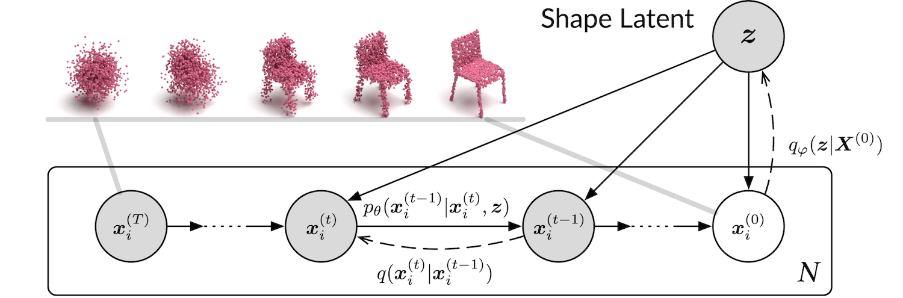

pr test
# Super Map - Point-based Fusion Head 
## - based on "Diffusion Probabilistic Models for 3D Point Cloud Generation"


[[Paper](https://arxiv.org/abs/2103.01458)] [[Code](https://github.com/luost26/diffusion-point-cloud)] [[Demo](https://huggingface.co/spaces/SerdarHelli/diffusion-point-cloud) Created by [SerdarHELLI](https://github.com/SerdarHelli)]

The official code repository for our CVPR 2021 paper "Diffusion Probabilistic Models for 3D Point Cloud Generation".

## Installation

**[Option 1]** Install via conda environment YAML file (**CUDA 11.6**).

```bash
# Create the environment
conda env create -f env.yml
# Activate the environment
conda activate dpm-pc-gen
```

Our model only depends on the following commonly used packages, all of which can be installed via conda.

| Package      | Version                          |
| ------------ | -------------------------------- |
| PyTorch      | ≥ 1.6.0                          |
| h5py         | *not specified* (we used 4.61.1) |
| tqdm         | *not specified*                  |
| tensorboard  | *not specified* (we used 2.5.0)  |
| numpy        | *not specified* (we used 1.20.2) |
| scipy        | *not specified* (we used 1.6.2)  |
| scikit-learn | *not specified* (we used 0.24.2) |
| open3d | *not specified* (we used 0.15.2) |

## About the EMD Metric

We have removed the EMD module due to GPU compatability issues. The legacy code can be found on the `emd-cd` branch.

If you have to compute the EMD score or compare our model with others, we strongly advise you to use your own code to compute the metrics. The generation and decoding results will be saved to the `results` folder after each test run.

## Datasets
1. [TartanAir Datasets](https://github.com/castacks/tartanair_tools) - [[Separate Sub Datasets](https://github.com/castacks/tartanair_tools/blob/master/download_training_zipfiles.txt)]


## Process and adjust the data
Use the scripts (`RGB2PointCloud.py`, `briefly_view_PtsCloud.py`, and `PtsCloud_process_save_as_hdf5.py`) in the `PtsDataFunc` folder  


## Training

```bash
# Train the model (default: in hospital environment)
python train_ae.py 
```

You may specify the value of arguments. Please find the available arguments in the script. 

Note that `--categories` can take `all` (use all the categories in the dataset), `airplane`, `chair` (use a single category), or `airplane,chair` (use multiple categories, separated by commas). {!!Only `hospital` and `hospitalRGB` available now!!}

## Testing
1. Enter the specific folder (`AE_****_**_**__**_**_**`) and `.pt` file name (`ckpt_********_******.pt`) in the `logs_ae` folder as part of the path below: 

```bash
# Test the model in hospital environment
python test_ae.py --ckpt ./logs_ae/AE_****_**_**__**_**_**/ckpt_********_******.pt --categories hospitalRGB
```

## Plots of loss and other information
Use `tensorboard` (recommand) to view or check the `plot_save` folder.

## Visualization of the output
Use ./plot_point_cloud.py file to visualize the outputs.

1. Enter the specific folder (`AE_Ours_hospitalRGB_**********`) in the `results` folder as part of the path below: 
2. Enter the test frame (`**`) you want to view (defual is `18`; from 0 to the max test frame you used in the data processing, eg.: 0, 2, ..., 10, 11, ...)

```bash
# View the output 
python plot_point_cloud.py --outputDir AE_Ours_hospitalRGB_********** --frameNum **
```

## Basic Code Reference

```
@inproceedings{luo2021diffusion,
  author = {Luo, Shitong and Hu, Wei},
  title = {Diffusion Probabilistic Models for 3D Point Cloud Generation},
  booktitle = {Proceedings of the IEEE/CVF Conference on Computer Vision and Pattern Recognition (CVPR)},
  month = {June},
  year = {2021}
}
```
